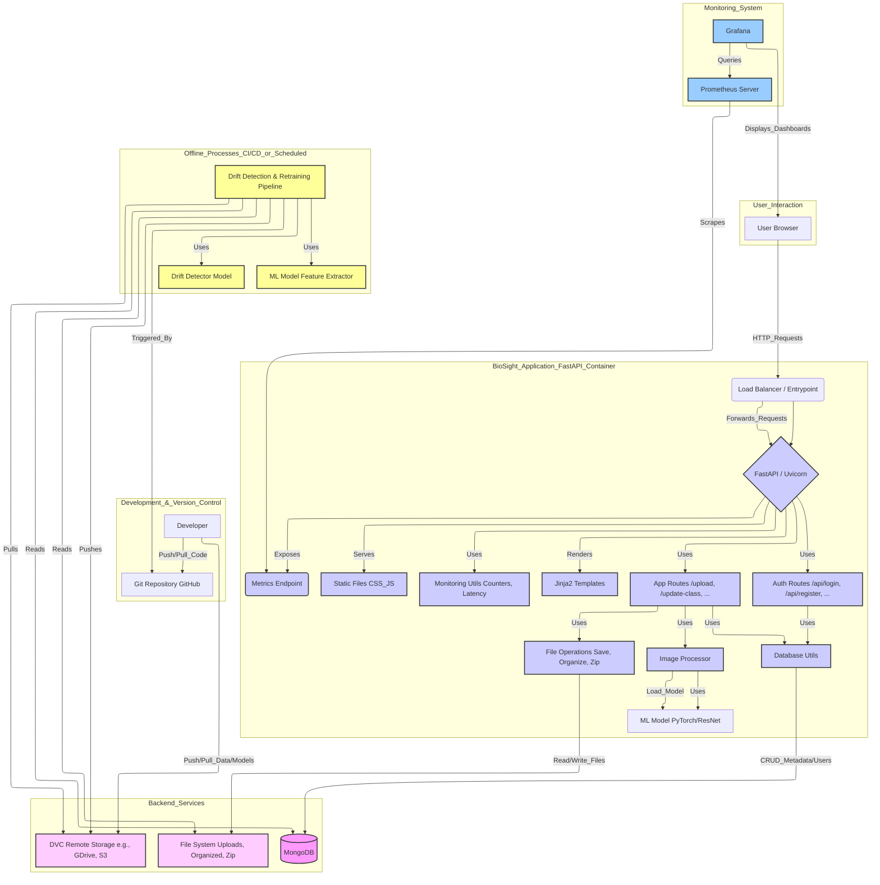

```mermaid

---
config:
    layout: elk
---
graph TD
    subgraph User_Interaction
        User[User Browser]
    end

    subgraph BioSight_Application_FastAPI_Container
        LB(Load Balancer / Entrypoint) --> AppServer{FastAPI / Uvicorn};
        AppServer -- Serves --> Static[Static Files CSS_JS];
        AppServer -- Renders --> Templates[Jinja2 Templates];
        AppServer -- Uses --> AuthRouter[Auth Routes /api/login, /api/register, ...];
        AppServer -- Uses --> AppRoutes[App Routes /upload, /update-class, ...];
        AppRoutes -- Uses --> FileOps[File Operations Save, Organize, Zip];
        AppRoutes -- Uses --> ImgProc[Image Processor];
        ImgProc -- Uses --> MLModel[ML Model PyTorch/ResNet];
        AppRoutes -- Uses --> DBUtil[Database Utils];
        AuthRouter -- Uses --> DBUtil;
        AppServer -- Exposes --> Metrics("Metrics Endpoint");
        AppServer -- Uses --> Monitoring[Monitoring Utils Counters, Latency];
    end

    subgraph Backend_Services
        DB[(MongoDB)]
        FS[File System Uploads, Organized, Zip];
        DVC[DVC Remote Storage e.g., GDrive, S3];
    end

    subgraph Monitoring_System
        Prometheus[Prometheus Server];
        Grafana[Grafana];
    end

    subgraph Offline_Processes_CI/CD_or_Scheduled
        Pipeline[Drift Detection & Retraining Pipeline];
        Pipeline -- Reads --> DB;
        Pipeline -- Reads --> FS;
        Pipeline -- Pulls --> DVC;
        Pipeline -- Pushes --> DVC;
        Pipeline -- Uses --> MLModelFeatures[ML Model Feature Extractor];
        Pipeline -- Uses --> DriftDetector[Drift Detector Model];
    end

    subgraph Development_&_Version_Control
        Developer[Developer];
        Git[Git Repository GitHub];
        Developer -- Push/Pull_Code --> Git;
        Developer -- Push/Pull_Data/Models --> DVC;
        Pipeline -- Triggered_By --> Git;
    end

    %% Interactions
    User -- HTTP_Requests --> LB;
    LB -- Forwards_Requests --> AppServer;
    AppServer
    User;

    DBUtil -- CRUD_Metadata/Users --> DB;
    FileOps -- Read/Write_Files --> FS;
    ImgProc -- Load_Model --> MLModel;

    Prometheus -- Scrapes --> Metrics;
    Grafana -- Queries --> Prometheus;
    Grafana -- Displays_Dashboards --> User;

    %% Style (Optional)
    classDef fastapi fill:#ccf,stroke:#333,stroke-width:2px;
    classDef db fill:#f9f,stroke:#333,stroke-width:2px;
    classDef storage fill:#fcf,stroke:#333,stroke-width:2px;
    classDef monitoring fill:#9cf,stroke:#333,stroke-width:2px;
    classDef pipeline fill:#ff9,stroke:#333,stroke-width:2px;
    class AppServer,AuthRouter,AppRoutes,FileOps,ImgProc,DBUtil,Metrics,Monitoring,Static,Templates fastapi;
    class DB db;
    class FS,DVC storage;
    class Prometheus,Grafana monitoring;
    class Pipeline,MLModelFeatures,DriftDetector pipeline;

```